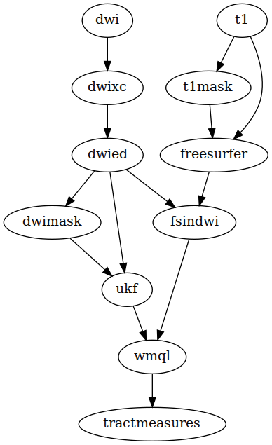

*pnlpipe* is a framework for the authoring and running of file based data
processing pipelines, as well as for the automated installation of prerequisite
software packages. Once you have written a pipeline, and the installation
recipes for the software it relies on, you will be able run it with one or more
combinations of parameters (including multiple software versions), and be able
to build all of its dependent software automatically. It is efficient in that it
will only regenerate outputs when their upstream dependencies have changed, and
will share outputs between pipelines.

Included are some of the PNL's neuroimaging pipelines, written using a library
and scripts that you can use to extend and write new pipelines.

<!-- markdown-toc start - Don't edit this section. Run M-x markdown-toc-generate-toc again -->
**Table of Contents**

- [Quick Walkthrough](#quick-walkthrough)
    - [1. Configure your input data](#1-configure-your-input-data)
    - [2. Run your pipelines](#2-run-your-pipelines)
        - [Choose and setup a pipeline](#choose-and-setup-a-pipeline)
        - [Run and monitor the pipeline](#run-and-monitor-the-pipeline)
- [Listing output](#listing-output)
- [PNL: Running on the cluster](#pnl-running-on-the-cluster)
- [Multiple Parameter Combinations](#multiple-parameter-combinations)
    - [Lists of parameter values](#lists-of-parameter-values)
    - [Lists of parameter dictionaries](#lists-of-parameter-dictionaries)
    - [Running and listing specific parameter combinations](#running-and-listing-specific-parameter-combinations)
- [Shell environment](#shell-environment)
- [Writing your own pipelines](#writing-your-own-pipelines)

<!-- markdown-toc end -->

# Quick Walkthrough

## 1. Install pnlpipe to Your Project Directory

    cd /project/dir
    git clone https://github.com/reckbo/pnlpipe.git && cd pnlpipe

## 2. Configure Environment (this is for non-PNL users)

    cd python_env
    make conda  # makes pnlpipe environment for conda
    source activate pnlpipe
    export PNLPIPE_SOFT=/path/to/software/dir  # where software modules will be installed

## 3. Configure your input data

Edit the paths of `INPUT_KEYS` in `pnlpipe_config.py` to point to your data. It will
look something like

    INPUT_KEYS = {
        'caseid_placeholder': '001',
        'dwi': '../001/001-dwi.nhdr',
        't1': '../001/001-t1w.nrrd'
        't2': '../001/001-t2w.nrrd'
    }

Each path is a template that is has a placeholder representing a case id (in
this example its '001'). Every pipeline is expected to accept a case id
parameter, and when run with a particular id, it will use this dictionary to
find the input paths it needs. You only need to define this dictionary once.

## 4. Run your pipelines

### Setup

Premade pipelines are in the `pnlpipe_pipelines` directory. For example, the
standard PNL pipeline is defined in `pnlpipe_pipelines/std.py`, and the EPI
correction pipeline is defined in `pnlpipe_pipelines/epi.py`. You can also get a
list of available pipelines by running `./pnlpipe -h`. As an example, we will
run the PNL standard pipeline, the one named `std`.

Before running a pipeline, we need to configure it. This involves two steps:
one, we need to specify its parameters, and two, we need to build the
software it requires.

To specify the parameters, we put them a [yaml](http://www.yaml.org/start.html)
configuration file, in this case called `pnlpipe_params/std.params`. To make a
default version of this file, run

    ./pnlpipe std init

This makes a parameter file with the pipeline's default parameters. For the
`std` pipeline, the most important ones are the input keys, `inputDwiKey`,
`inputT1Key`, etc. These are the keys the pipeline uses to find its input data,
by looking up their paths in `pnlpipe_config.INPUT_KEYS`. For example,
`inputDwiKey: [dwi]` means that the pipeline will find its DWI input by looking
up 'dwi' in `INPUT_KEYS`. Likewise, `inputT1Key: [t1]` means that the pipeline
will find its T1w input by looking up 't1' in `INPUT_KEYS`.  The reason it is
done this way is that if you happen to reorganize your data, you just have to
update your `pnlpipe_config.INPUT_KEYS`, and your parameters remain the same.

Another important field is `caseid`; the default is `./caselist.txt`, which
means the pipeline will look in that file to find the case ids you want to use
with this pipeline. Make it by putting each case id on its own line.

You will notice that the parameter values are wrapped in square brackets. This
is because you can specify more than one value for each parameter. For example,
if you wanted to run the `std` pipeline using a DWI masking bet threshold of 0.1
as well as a 0.15, you would write: `bet_threshold: [0.1, 0.15]`. For more
details on specifying multiple parameter combinations, see further down in this
README.

Now you're ready to build the software needed by the pipeline. The required
software is determined by the parameters that end in '_version' and '_hash' (a
Github commit hash). Before building the software packages, you need to specify
the directory to install them to, and you do this by setting a global
environment variable called `$PNLPIPE_SOFT` (e.g. `export PNLPIPE_SOFT=path/to/software/dir`).
Now build the software by running

    ./pnlpipe std setup

(if any of the software packages already exist, they will not rebuild). You should now
see the results in `$PNLPIPE_SOFT`, such as `BRAINSTools-bin-2d5eccb/` and
`UKFTractography-421a7ad/`.

### Run and monitor

Now you're read to run the pipeline:

    ./pnlpipe std run

This runs the `std` pipeline for every combination of parameters in
`std.params`. Since we're using the defaults, there is only one combination of
parameters per case id.

You can get an overview of the pipeline and its progress by running

    ./pnlpipe std status

This prints the pipeline's parameters, the input and output paths, and how many
case ids are processed thus far.

When the pipeline is done, you can generate a summary report:

    ./pnlpipe std summarize

This makes `_data/std-tractmeasures.csv`, a csv of all wmql tract measures
across all subjects, and `_data/std-tractmeasures-summary.csv`, a summary csv of
wmql tract measures together with their counterparts from the INTRuST dataset as
a way of comparison.

You're not limited to running one pipeline, you can run any number of the
pipelines available. For example, you could now run the EPI distortion
correction pipeline in order to compare its results to that of the standard one:

    ./pnlpipe epi init
    # edit pnlpipe_params/epi.params
    ./pnlpipe epi setup
    ./pnlpipe epi run
    ./pnlpipe epi summarize

You will then see the files

    _data/std-tractmeasures.csv
    _data/std-tractmeasures-summary.csv
    _data/epi-tractmeasures.csv
    _data/epi-tractmeasures-summary.csv

# Listing Your Pipeline's Output

Every pipeline gives a short name for some, usually all, of its outputs. You can
see these names when you run `./pnlpipe <pipeline> status` (or by inspecting the
pipeline's `make_pipeline` function in `pnlpipe_pipelines/<pipline>.py`). For
example, the `std` pipeline describes `dwied` as an eddy current corrected
DWI, and shows its output template path as `_data/<caseid>/DwiEd-<caseid>-...nrrd`.
To list the actual output paths of the eddy corrected DWI's for all your case ids, use the `ls` subcommand:

    pnlpipe std ls dwied

This lists all existing output.  If you'd like to get a list of missing
output, use the `-x` flag:

    ./pnlpipe std ls -x dwied

For all output, existing and missing, use `-a`:

    ./pnlpipe std ls -a dwied

Sometimes you just want the list of case ids for which a particular
output exists (or is missing), or perhaps you want the case ids alongside
their output paths.  You can do that as follows:

   ./pnlpipe std ls -s dwied # prints <caseid> for existing paths
   ./pnlpipe std ls -c dwid  # prints <caseid>,<path> for existing paths

You can combine flags together. To get the csv of all missing Freesurfer
subject directories, you would run

    ./pnlpipe std ls -cx fs

The `ls` command helps you inspect your generated data or use it for other types of
processing by piping its results to other commands. Say you want to get the
space directions of all your eddy corrected DWI's, you could do the following:

    ./pnlpipe std ls dwied | unu head | grep 'space directions'

# PNL: Running on the cluster

The PNL uses a high performance computing cluster for most of its data
processing, and this cluster
uses [LSF](https://en.wikipedia.org/wiki/Platform_LSF) to manage batch
processing. *pnlpipe* provides a Makefile that allows you to easily submit your
pipeline jobs to this system.

Edit `Makefile` and replace `std` in the line `PIPE := std` to the name
of the pipeline you wish to run. Now you can submit pipeline jobs for individual
case ids like this:

    make 001-bsub8 002-bsub8 003-bsub8

This submits an 8 core LSF job for each of the case ids `001`, `002`, and `003`.
If resources are limited, 4 cores might be better:

    make 001-bsub4 002-bsub4 003-bsub4

For a large case list, this method is tedious and it's possible that you accidentally submit
a job for a case id that's already in the queue or running.  A better way is to
run

    make caselist-bsub8  # or, make caselist-bsub4

This will iterate over each case id in `caselist.txt` and submit an 8 core job
to the LSF system, but only if that case id is not already running (it uses the
LSF command `bjobs` to determine this). If your caselist is not named
`caselist.txt`, edit the `Makefile` and modify the line `CASELIST :=
caselist.txt` to point to your file.

An alternative to modifying the Makefile is to set the variables on the command
line:

    make PIPE=std CASELIST=caselist2.txt caselist-bsub8

# Multiple Parameter Combinations

Sometimes you'd like to run a pipeline using different parameters, for example
when trying to optimize results, or to test out the effect of different software
versions. The walkthrough briefly mentioned how to have multiple parameter values,
but this section will provide more details.

## Lists of parameter values

Each pipeline has one parameters file: `pnlpipe_params/<pipeline>.params`. This
is a file that is expected to be in [yaml](http://www.yaml.org/start.html)
format and have either a single dictionary, or a list of dictionaries. The keys
of the dictionaries are the names of the arguments to the `make_pipeline`
function in the `pnlpipe_pipelines/<pipeline>.py`, and each key has a list of
values. When this parameter file is read, every combination of parameter values
is calculated, and each of these parameter combinations will be printed when you
run `./pnlpipe <pipeline> status`, and each will be used by pipeline when you
run `./pnlpipe <pipeline> run`.

Here's a simple example.  Say we have a pipeline `pnlpipe_pipelines/simply.py`,
with the following signature for `make_pipeline`:

    def make_pipeline(caseid, inputDwiKey, someparam=0.1):
       ...

When you run `./pnlpipe simple init`, it will make a file like this:

    caseid: [./caselist.txt]
    inputDwiKey: ['*mandatory*']
    someparam: [0.1]

Now say that our `pnlpipe_config.py` looks like the following:

        INPUT_KEYS = {
        'caseid_placeholder': '{case},
        'dwi': '../{case}/{case}-dwi.nhdr',
        'dwiharm': '../{case}/{case}-dwi-harm.nhdr'
        }

where `dwi` stands for our raw DWI's, and `dwiharm` are some preprocessed
versions. To run the `simple` pipeline on both types of DWI using the same
caselist, we would make our parameters

    caseid: [./caselist.txt]
    inputDwiKey: [dwi, dwiharm]
    someparam: [0.1]

Then `./pnlpipe simple status` will show the parameters, output template paths,
and progress for 2 parameter combinations, (`dwi`, `0.1`) and (`dwiharm`, `0.1`).
If we made `someparam: [0.1, 0.2]`, then there would be 4 parameter combinations.

## Lists of parameter dictionaries

Say that for the above example, instead of running the pipeline for `someparam=0.1`
and `someparam=0.2`  for both `dwi` and `dwiharm`, we only wanted to use `0.1` for
`dwi` and `0.2` for `dwiharm`, we could achieve that by writing two separate parameter
dictionaries:

    - caseid: [./caselist.txt]
      inputDwiKey: [dwi]
      someparam: [0.1]

    - caseid: [./caselist.txt]
      inputDwiKey: [dwi]
      someparam: [0.2]

(Make sure that all the parameter names line up with `caseid`!). Another example
is when you have input paths that are in different directories, each having
different case lists. To run the pipeline on both data sets, you would make 2
or more dictionaries:

    - caseid: [./caselist1.txt]
      inputDwiKey: [dwi2]
      someparam: [0.1]

    - caseid: [./caselist2.txt]
      inputDwiKey: [dwi2]
      someparam: [0.1]

## Running and listing specific parameter combinations

`./pnlpipe <pipeline> run` will automatically run for every parameter combination.
To only run it for particular combination, you can use the `-p` switch.

    ./pnlpipe <pipeline> run -p 2

This runs the pipeline for the second parameter combination, as listed by `./pnlpipe <pipeline> status`.
`ls` and `env` behave similarly:

    ./pnlpipe <pipeline> ls dwi -p 1
    eval $(./pnlpipe <pipeline> env -p 1)

# Shell environment

## Pipeline shell environment

Sometimes you want access to the same software environment that your pipeline
does when it runs with a particular parameter combination.  This is possible by using
the `env` command.

    ./pnlpipe <pipeline> env -p 2

prints a Bash setup that exports the software paths and example data paths for
`<pipeline>'s` second parameter combination. To add them to your environment,
run

    eval `./pnlpipe <pipeline> env -p 2`  # or
    eval $(./pnlpipe <pipeline> env -p 2)

## Ad-hoc shell environment

Some of the pre-made software modules make a file called `env.sh` as part of their output,
and sourcing that file will add their software path to the `PATH` environment variable,
as well as set any other necessary environment variables.  Currently, the following
modules make an `env.sh` file:

* UKFTractography
* BRAINSTools
* tract_querier
* whitematteranalysis

E.g. to add `tract_querier` to the `PATH` and `PYTHONPATH`, you would run

    source $PNLPIPE_SOFT/tract_querier-<hash>/env.sh

# Installing Software Without Using a Pipeline

You can install software without configuring a pipeline and running `./pnlpipe <pipeline> setup`.
To do this, use the `install` subcommand:

    ./pnlpipe install <software> [--version <version>]

E.g. to install the `DiffusionPropagator` branch of `UKFTractography`, run

    ./pnlpipe install UKFTractography --version DiffusionPropagator

To install the Github revision `41353e8` of [BRAINSTools](https://github.com/BRAINSia/BRAINSTools/),
run

    ./pnlpipe install BRAINSTools --version 41353e8

Each software module interprets version in its own way. Most of the time,
`--version` expects a Github revision, as for these examples. However
the switch is optional; running `install` without specifying a version will
install the software's default version.

Here's an example on how to install the Washington
University's
[HCP Pipeline scripts](https://github.com/Washington-University/Pipelines):

    ./pnlpipe install HCPPipelines --version 3.22.0

# `pnlscripts`

`pnlscripts` is a directory of PNL specific scripts that implement various
pipeline steps. The PNL pipelines (via the nodes defined in
`pnlpipe_pipelines/_pnl.py`) call these scripts at each step. These scripts are
the successors to the ones in [pnlutil](https://github.com/pnlbwh/pnlutil).
Besides being more robust and up to date with respect to software such
as [ANTS](http://stnava.github.io/ANTs/), they are implemented in python using
the shell scripting library [plumbum](https://plumbum.readthedocs.io/en/latest/).
Being written in python means they are easier to understand and modify,
and [plumbum](https://plumbum.readthedocs.io/en/latest/) allows them to be
almost as concise as a regular shell script.

You can call any these scripts directly, e.g.

    ./pnlscripts/bse.py -h

To add them to the path, run `source env.sh`, and you'll be able to call
them from any directory.

It's important to note that usually the scripts are calling other binaries, such
as those in [BRAINSTools](https://github.com/BRAINSia/BRAINSTools/). All the
software they rely on, with the exception of FreeSurfer and FSL, can be
installed by setting up a pipeline and running `./pnlpipe <pipeline> setup`, or
by running `./pnlpipe install <software> `. The software is installed to the
`$PNLPIPE_SOFT` directory. Some of the software modules also write an `env.sh`
file to their output directories, which you can source to add them to your
environment (see the section above). This makes it easy to add them to your
environment before calling any of the scripts in `pnlscripts`.

# Writing your own pipelines

A pipeline is a directed acyclic graph (DAG) of dependencies.  Here's a diagram
of the standard PNL pipeline's DAG.

Each node represents an output, and the arrows represent dependencies.
To author a pipeline in *pnlpipe*, you construct a DAG using python code.
This DAG must be returned by a function called `make_pipeline` in
a python module under `pnlpipe_pipelines`.  The name of the module
is used as the name of the pipline.  You will then be able to
run any of the `./pnlpipe <pipeline>` subcommands.

This section will be expanded in the future, but for now, see
`pnlpipe_pipelines/std.py` for an example on how to construct a pipeline, and
see `pnlpipe_pipelines/_pnl.py` for examples on how to write your own nodes.

## Plumbum: Shell Scripting with Python

`pnlscripts`
from plumbum.cmd import script
from pnlscripts.util.scripts import

# Issues

### error: error setting certificate verify locations:

During the setup phase you may encounter this error, in which case
run

    git config --global http.sslverify "false"

and run setup again.
